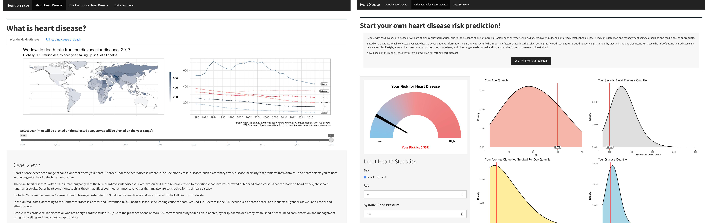

# Shiny App on Heart Disease Investigation

## Introduction

In this repository, we write a Shiny app in R. This shiny app is to provide an 
introduction of heart disease and raise an interactive page for user to 
predict their own risks for heart disease based on their health statistics. 
Click [here](https://chengxin-yang.shinyapps.io/HeartDisease/) to launch the app!

## General contents

There are three pages in the app. 

The first page provides an overview about heart disease. Several plots are 
displayed in this page, including maps, barplots and line charts, to help users 
get an idea of how heart disease is going on in the globe and in the United 
States. Also, there are several widges, allowing users to filter the results 
of their particular interests. 

In the second page, we intend to give the users a useful tool for evaluating the 
risk of suffering from coronary heart disease in the future ten years. We adopt 
the data from [Framingham Heart study](https://www.kaggle.com/amanajmera1/framingham-heart-study-dataset/data) 
to build our model. The user can input their health statistics through the 
widgets on the left side and get the results back by clicking on the "Get Your 
Risk Evaluation" bottom. The overall risk will be shown on the left by an arc 
segment plot. The threshold for prediction is 1.00. If the risk is greater than 
the threshold, the model will classified the "Yes/No" of having a heart attack 
as "Yes". The higher the risk is, the more definite we are that a heart disease 
will happen. The plots on the right side will demonstrate the quantile of the 
value of each predictor among the population density. Overall, the predictors 
shown are negatively related to the risk. Male is more vulnerable than female. 

In interpreting the results, the evaluated risk by our model is conservative, 
which means that it will not over-predict the risk. Thus, if the risk is above 
1.00, we would strongly recommend further medical measures to be taken in order 
to prevent the heart disease.

Finally, in the third page, we put up the relevant source data on it. 

## Launch the app

To launch the app locally, after cloning the repository to your own machine, 
you just need to visit "HeartDisease/" and run "app.R". 

A thing to mention is that there is a large csv data involved in the app and we 
don't upload this csv onto the git repository (while we do have uploaded other 
small-size files onto the "HeartDisease/Data/" folder). Therefore, the first 
time you run the app, it will take you for some time to download the csv file.

Depending on your internet, if it is hard for you to download the file from 
your R console, then directly copying the url into a browser may help to 
download it successfully. For detailed instruction, see the comments in 
"HeartDisease/Part1.R". 

After downloading the csv file into the corresponding directory, the next time 
you launch the app, it will be much quicker.

## Error Messages / Warnings

Two kinds of error messages and warnings will pop up in the app: 

- "No data available, please change your search parameters!": This error 
message may pop up when doing search on the first page. It's because 
you don't specify a `Year` input, which is a required parameter, or because 
there is truely no result under the parameters you specify.

- "The ... permitted is from ... to .... The output may not be significative.":
This warning may pop up when playing with the prediction model on the second 
page. It is because the numeric value you specify is far from the range that 
the data provides, so the modeling result may be unreliable. 